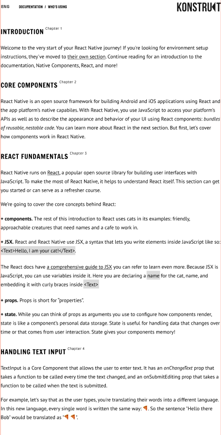

# BeetRootEducation

_LMS Beetroot Academy progress_

## ДОМАШНЄ ЗАВДАННЯ

**Обов'язково:**

- Зверстати сторінку і підключити усі необхідні шрифти - [посилання](https://www.figma.com/file/pKSsjdpNxqs0c9Cc0aZFUX/web-fonts).

Екстра:

- До макету Denis Novic підключити сімейство шрифтів Gilroy і замінити їх відповідно до макету.

